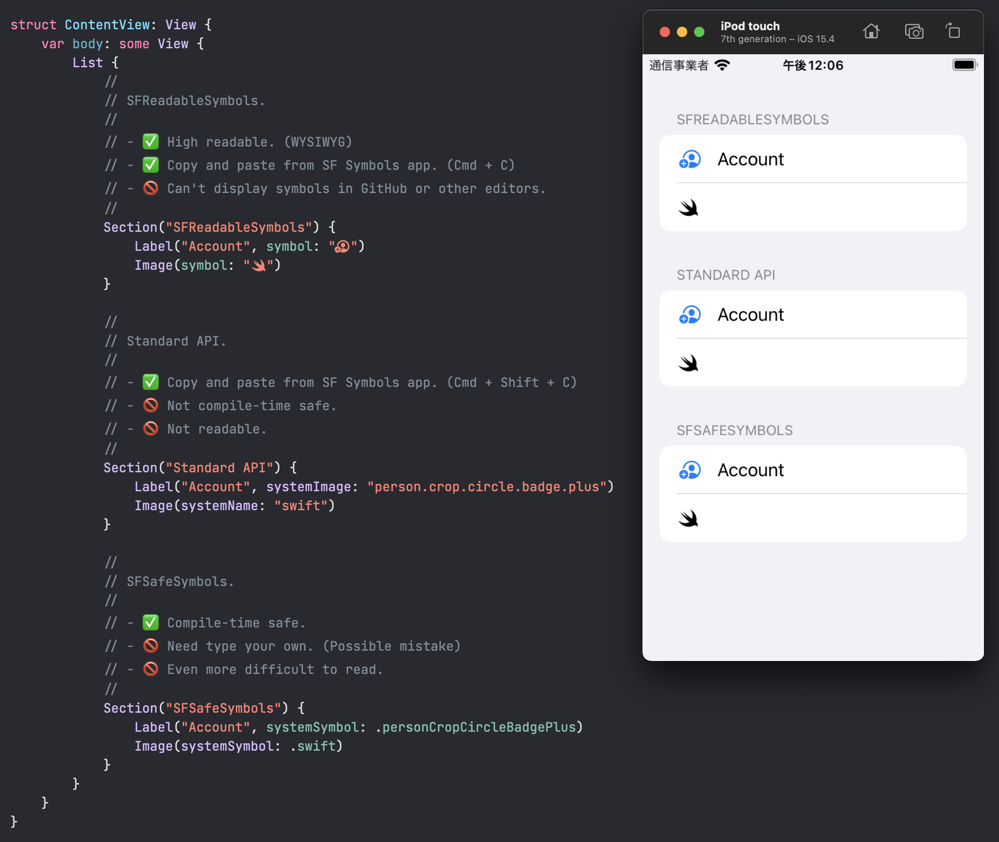

# SFReadableSymbols

High-readable code with SFSymbols.



## Install

```swift
// Swift 5.6+
.package(url: "https://github.com/YusukeHosonuma/SFReadableSymbols.git", from: "1.0.0")

// Other
.package(url: "https://github.com/YusukeHosonuma/SFReadableSymbols.git", .upToNextMajor(from: "1.0.0"))
```

## Requirements

- SFSymbols **3.2 (67)** only. (At least now)
- iOS 15+
- macOS 12+
- tvOS 15+
- WatchOS 8+

## Author

Yusuke Hosonuma / [@tobi462](https://twitter.com/tobi462)
